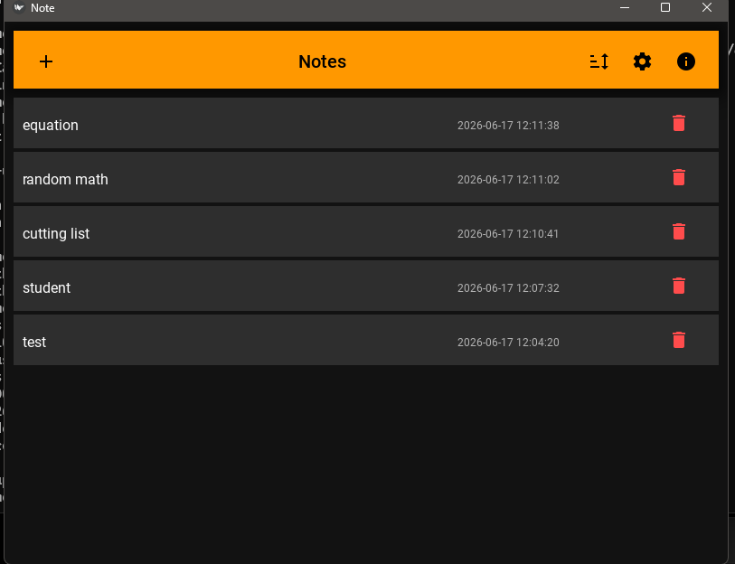
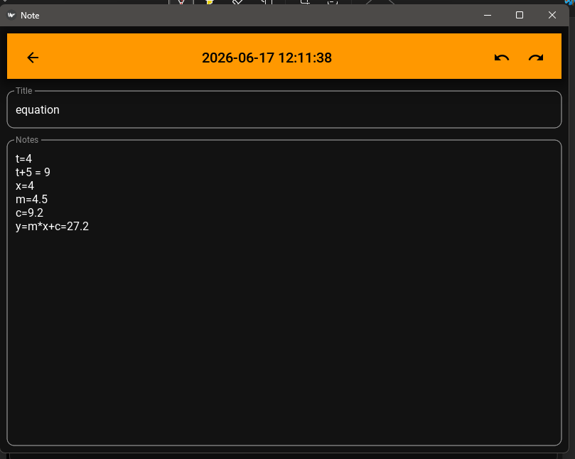

# Notepad Calculator

A lightweight note-taking application with built-in calculator functionality.

Notepad Calculator combines quick note taking with inline arithmetic calculations, making it useful for shopping lists, budgeting, measurements, engineering calculations, school work, and everyday note keeping.

---

## Screenshots

### Notes List



The home screen displays all saved notes with timestamps and quick actions for creating, sorting, and deleting notes.

### Editor Screen



The editor automatically saves changes and evaluates mathematical expressions directly inside your notes.

---

## Features

### Notes

* Create and edit notes
* Automatic saving
* Delete unwanted notes
* Sort notes by modification date
* Timestamp tracking with seconds

### Calculator

* Perform arithmetic directly in notes
* Use variables in calculations
* Reuse values throughout a note
* Ideal for shopping lists, estimates, measurements, and quick calculations

### Interface

* Light Theme
* Dark Theme
* Undo / Redo support
* Simple and distraction-free layout

---

# Getting Started

1. Run **main.exe**
2. Click the **+** button to create a new note.
3. Enter a title.
4. Start typing notes or calculations.
5. Notes are saved automatically.

No setup or configuration is required.

---

# Calculator Examples

## Basic Arithmetic

Input:

```text
3+3
```

Result:

```text
3+3 = 6
```

---

## Multiple Calculations

Input:

```text
5*10
100/4
25+15
```

Result:

```text
5*10 = 50
100/4 = 25
25+15 = 40
```

---

## Variables

Input:

```text
c=5
m=3
x=20
y=m*x+c
```

Result:

```text
c=5
m=3
x=20
y=m*x+c=65
```

---

## Shopping List

Input:

```text
milk=10*100
eggs=30*50
bread=2*100
```

Result:

```text
milk=10*100=1000
eggs=30*50=1500
bread=2*100=200
```

---

## Budget Example

Input:

```text
rent=1200
food=350
transport=120
total=rent+food+transport
```

Result:

```text
rent=1200
food=350
transport=120
total=rent+food+transport=1670
```

---

# Managing Notes

### Create a Note

Click the **+** button on the main screen.

### Open a Note

Click on a note title.

### Delete a Note

Click the trash icon next to the note.

### Sort Notes

Use the sort button on the toolbar.

### Change Theme

Open Settings and select Light or Dark mode.

---

# Data Storage

All notes are stored automatically in a local data file.

Your notes remain available the next time the application is opened.

---

# Known Limitations

* Calculations support basic arithmetic operations.
* Notes are stored locally on the current device.
* No cloud synchronization.
* No note search functionality yet.

---

# Planned Features

* Search notes
* Export notes
* Import backups
* Markdown support
* Syntax highlighting
* Categories and tags
* Cloud synchronization

---

# Version

Version 1.0

---

# Author

TTK

Built for fast note taking and quick calculations in a single workspace.
